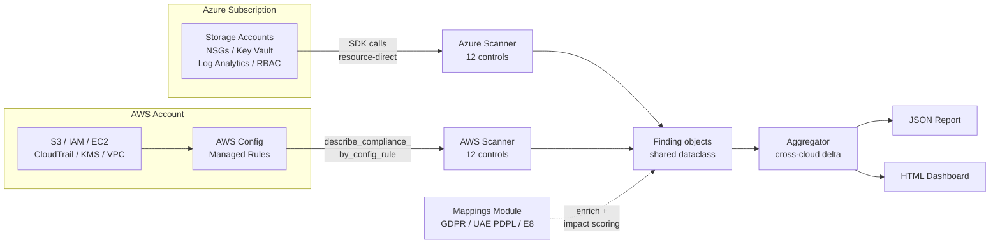
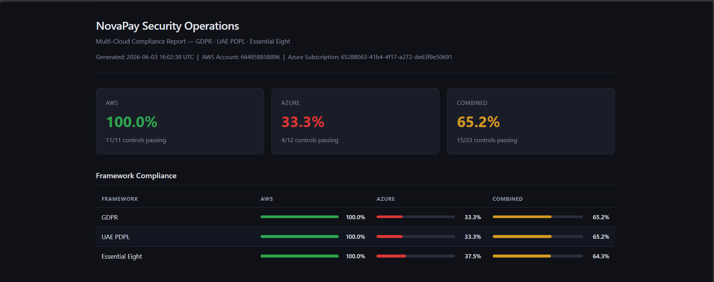
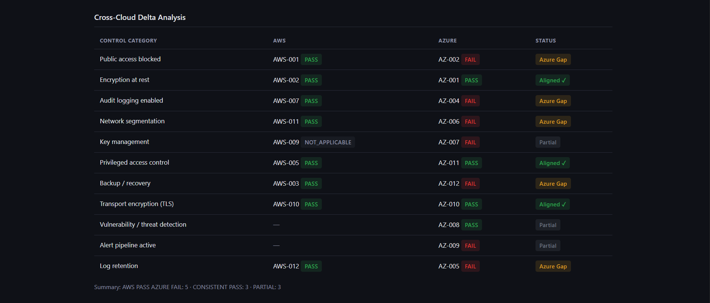
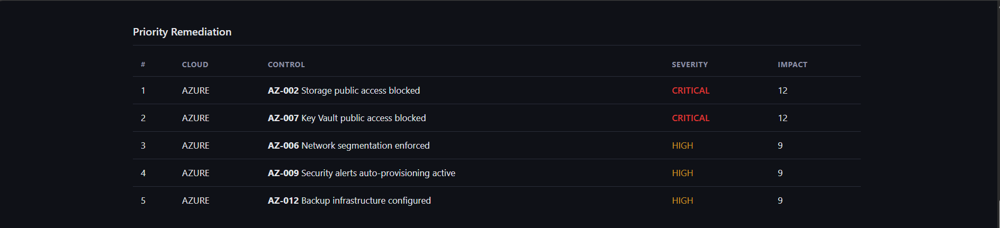

# NovaPay Security Operations

A multi-cloud compliance scanner that evaluates AWS and Azure environments against 24 security controls mapped to GDPR, UAE PDPL, and Essential Eight requirements. The scanner uses cloud-native APIs (Azure Resource Manager and AWS Config) to assess each environment, then produces a **cross-cloud delta** — surfacing categories where equivalent controls produce different compliance outcomes between AWS and Azure.

The project was developed against a fictional fintech scenario (NovaPay) to simulate the regulatory environment of a payment services organization operating across multiple jurisdictions. The cross-cloud delta is the core differentiator: single-cloud scanners cannot surface compliance gaps that exist *between* cloud providers, where a control passes on one cloud but fails on its equivalent on another.

---

## Architecture



**Design choice:** the two scanners use different patterns by design, not by accident. AWS Config provides managed rule evaluations as a service, so the AWS scanner consumes those results directly. Azure has no Config equivalent for the controls covered here, so the Azure scanner makes direct SDK calls and evaluates resource properties in code. Both scanners output the same `Finding` dataclass, which lets the aggregator merge results regardless of how they were collected.

---

## What This Project Does Differently

Most cloud compliance scanners assess one cloud at a time. NovaPay operates across AWS and Azure, and a control passing in one cloud but failing on its equivalent in the other creates a compliance gap that single-cloud scanners miss entirely.

The aggregator pairs equivalent controls across clouds — for example, `AZ-002 Storage public access blocked` is paired with `AWS-001 S3 public access blocked`. For each pair, the output classifies the result:

| Delta Type | Meaning |
|---|---|
| `CONSISTENT_PASS` | Both clouds pass the equivalent control — no action needed |
| `CONSISTENT_FAIL` | Both clouds fail — systemic issue across the multi-cloud posture |
| `AWS_PASS_AZURE_FAIL` | AWS is compliant, Azure has the gap — remediate Azure |
| `AZURE_PASS_AWS_FAIL` | Azure is compliant, AWS has the gap — remediate AWS |
| `PARTIAL` | One side has no equivalent control, or evaluation is not applicable |

**Example output from a real scan:**

```
Public access blocked        AWS:AWS-001 PASS   Azure:AZ-002 FAIL   → AWS_PASS_AZURE_FAIL
Encryption at rest           AWS:AWS-002 PASS   Azure:AZ-001 PASS   → CONSISTENT_PASS
Audit logging enabled        AWS:AWS-007 PASS   Azure:AZ-004 FAIL   → AWS_PASS_AZURE_FAIL
Network segmentation         AWS:AWS-011 PASS   Azure:AZ-006 FAIL   → AWS_PASS_AZURE_FAIL
Key management               AWS:AWS-009 N/A    Azure:AZ-007 FAIL   → PARTIAL
Privileged access control    AWS:AWS-005 PASS   Azure:AZ-011 PASS   → CONSISTENT_PASS
Backup / recovery            AWS:AWS-003 PASS   Azure:AZ-012 FAIL   → AWS_PASS_AZURE_FAIL
Transport encryption (TLS)   AWS:AWS-010 PASS   Azure:AZ-010 PASS   → CONSISTENT_PASS
Log retention                AWS:AWS-012 PASS   Azure:AZ-005 FAIL   → AWS_PASS_AZURE_FAIL
```

The five `AWS_PASS_AZURE_FAIL` rows are the actionable cross-cloud findings — a CISO can take this list to the Azure platform team with concrete remediation targets.

---

## Frameworks Covered

| Framework | Coverage | Notes |
|---|---|---|
| GDPR (EU) | 24/24 controls | All 24 mapped to specific GDPR articles (Art. 5, 30, 32, 33, 44) |
| UAE PDPL | 24/24 controls | Mapped to Art. 16, 20, 22 |
| Essential Eight (ACSC) | 14/24 controls | E8 strategies are narrow by design — only controls matching application control, restrict admin privileges, MFA, and backups are mapped |

Each finding carries an **impact score** computed as `severity_weight × frameworks_affected_count`, allowing prioritized remediation across the multi-framework regulatory surface.

---

## Controls Implemented

### Azure (12 controls, direct SDK)

| ID | Control | Severity |
|---|---|---|
| AZ-001 | Storage encryption at rest | HIGH |
| AZ-002 | Storage public access blocked | CRITICAL |
| AZ-003 | Storage HTTPS-only enforced | HIGH |
| AZ-004 | Audit logging enabled (diagnostic settings) | HIGH |
| AZ-005 | Log Analytics retention >= 90 days | MEDIUM |
| AZ-006 | Network segmentation (NSG rule analysis) | HIGH |
| AZ-007 | Key Vault public access blocked | CRITICAL |
| AZ-008 | Vulnerability assessment (Defender for Cloud) | HIGH |
| AZ-009 | Security alert auto-provisioning active | HIGH |
| AZ-010 | Minimum TLS version 1.2 enforced | HIGH |
| AZ-011 | RBAC least-privilege audit | HIGH |
| AZ-012 | Backup infrastructure configured | HIGH |

### AWS (12 controls, via Config managed rules)

| ID | Control | Config Rule | Severity |
|---|---|---|---|
| AWS-001 | S3 public access blocked | S3_BUCKET_PUBLIC_ACCESS_PROHIBITED | CRITICAL |
| AWS-002 | S3 encryption at rest | S3_BUCKET_SERVER_SIDE_ENCRYPTION_ENABLED | HIGH |
| AWS-003 | S3 versioning enabled | S3_BUCKET_VERSIONING_ENABLED | MEDIUM |
| AWS-004 | Root account MFA enabled | ROOT_ACCOUNT_MFA_ENABLED | CRITICAL |
| AWS-005 | Root access keys disabled | IAM_ROOT_ACCESS_KEY_CHECK | CRITICAL |
| AWS-006 | IAM password policy compliant | IAM_PASSWORD_POLICY | HIGH |
| AWS-007 | CloudTrail enabled in all regions | CLOUD_TRAIL_ENABLED | CRITICAL |
| AWS-008 | CloudTrail log file validation | CLOUD_TRAIL_LOG_FILE_VALIDATION_ENABLED | HIGH |
| AWS-009 | KMS key rotation enabled | CMK_BACKING_KEY_ROTATION_ENABLED | HIGH |
| AWS-010 | EBS encryption by default | EC2_EBS_ENCRYPTION_BY_DEFAULT | HIGH |
| AWS-011 | Security groups restrict inbound | RESTRICTED_INCOMING_TRAFFIC | CRITICAL |
| AWS-012 | VPC flow logs enabled | VPC_FLOW_LOGS_ENABLED | HIGH |

---

## How to Run

### Prerequisites

- Python 3.12+
- Azure CLI (`az login` completed)
- AWS CLI configured with named profiles
- AWS Config rules deployed in the target AWS account

### Setup

```bash
git clone https://github.com/Lalith012/novapay-security-operations.git
cd novapay-security-operations

python -m venv venv
.\venv\Scripts\activate              # Windows
source venv/bin/activate             # Linux/Mac

pip install -r requirements.txt

cp .env.example .env
# Edit .env with your Azure subscription ID, AWS profile, AWS region
```

### Run individual scanners

```bash
# Azure only
python -m src.scanner.azure_scanner

# AWS only
python -m src.scanner.aws_scanner
```

### Run multi-cloud scan with cross-cloud delta

```bash
python -m src.scanner.aggregator
```

Both JSON and HTML reports are written to `findings/reports/` with timestamped filenames.

---

## Sample Output

### Executive Summary



### Cross-Cloud Delta



### Priority Remediation



---

## Testing & CI

20 unit tests cover mapping coverage, impact scoring, aggregator delta logic, and Finding enrichment. Tests are behavioural — they verify what the system produces, not how it produces it — so they do not break on internal refactoring.

```bash
pytest tests/ -v
```

GitHub Actions runs `ruff` (lint) and `pytest` on every push to main. The CI workflow lives at `.github/workflows/ci.yml`. No cloud credentials are used in CI; the tests run entirely against the data model.

---

## Project Structure

```
novapay-security-operations/
├── src/
│   ├── scanner/
│   │   ├── models.py            # Finding dataclass (shared by both scanners)
│   │   ├── azure_scanner.py     # 12 Azure controls via direct SDK
│   │   ├── aws_scanner.py       # 12 AWS controls via Config rules
│   │   └── aggregator.py        # Cross-cloud delta + unified output
│   ├── reports/
│   │   ├── json_writer.py       # Timestamped JSON reports
│   │   ├── unified_report.py    # HTML report renderer
│   │   └── html_template.html   # Self-contained Jinja2 template
│   └── mappings/
│       ├── __init__.py          # Mapping API + impact scoring
│       ├── gdpr.py              # 24 controls -> GDPR articles
│       ├── uae_pdpl.py          # 24 controls -> UAE PDPL articles
│       └── essential_eight.py   # 14 controls -> ACSC E8 strategies
├── tests/
│   └── test_scanner.py          # 20 behavioural unit tests
├── .github/workflows/
│   └── ci.yml                   # Lint + test on every push
├── findings/
│   ├── reports/                 # Scan output (JSON + HTML), gitignored
│   └── screenshots/             # Sample report screenshots
├── config.py                    # Environment configuration
└── requirements.txt
```

---

## Disclaimer

**NovaPay is a fictional fintech company used as a unifying scenario for this portfolio project.** It is not a real organization, does not process actual payments, and is not affiliated with any existing financial institution. All test resources, regulatory framework mappings, and compliance assessments are educational artifacts. The scanner code is functional and runs against real AWS and Azure infrastructure, but the NovaPay context exists purely to make the project narrative concrete.

The framework mappings reflect this developer's interpretation of how technical controls support GDPR, UAE PDPL, and Essential Eight requirements. They are not a substitute for legal review or formal compliance attestation.

---

## License

MIT — see [LICENSE](LICENSE) for full text.